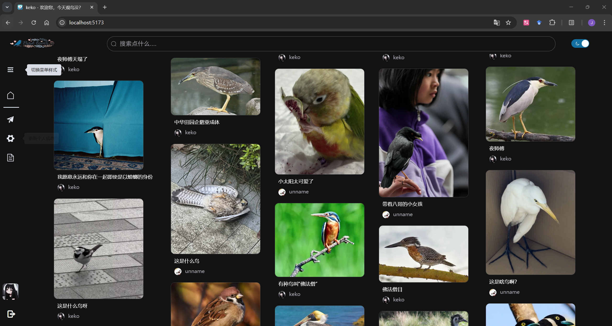
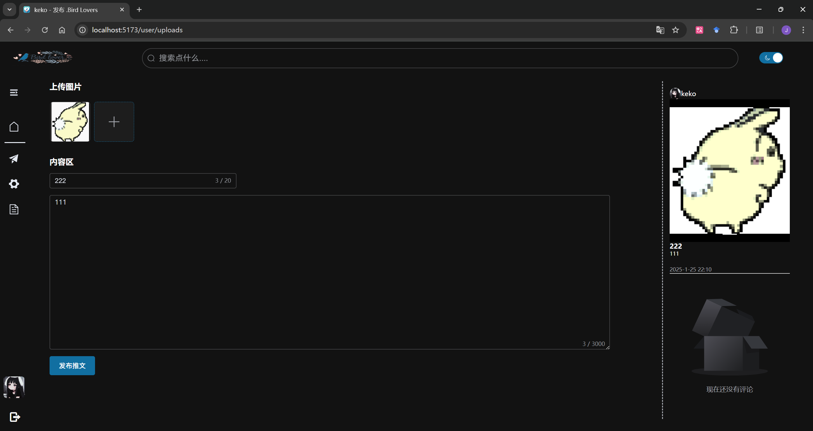
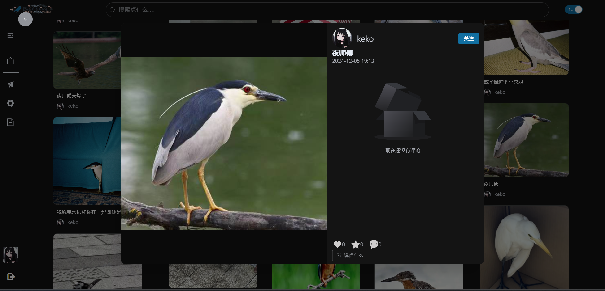
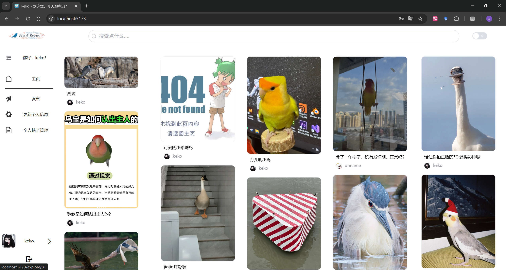
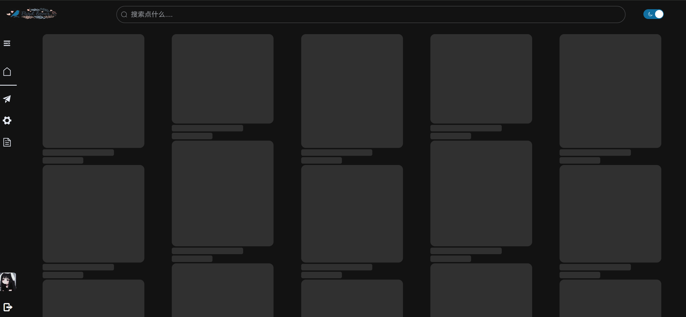

# 基于vue3和element-plus前后端项目

此仓库是[Vue3_web_redbook](https://github.com/xishandong/Vue3_web_redbook)的一个变体。
原项目是模仿小红书web端的一个页面。

 

 

 

 

 

## 🌟 组件优化
- 重构 cardDetail 样式，使用 SCSS和计算样式。
- 封装全局cardDetail、backPage、cardSkeleton 插件。
- 添加图片懒加载插件。
- 更新用户投稿图像和头像上传 API 。

## 🎨 UI / 主题
- 统一 Element Plus 配置，并增加夜间模式。
- 优化登录、注册和主页卡片的显示逻辑。
- 增加加载骨架屏及图片请求占位。

## 🔨 重构与优化
- 优化瀑布流布局逻辑。
- 精简冗余代码。
- 重写SCSS，使用 rem/calc/relative/css变量 替换 px。

## 🏃‍♂️项目运行

``` bash
npm update
npm run build
npm run dev
```

## 原作者个人博客
[回锅炒辣椒的个人博客](https://www.xsblog.site/)

## 后端代码仓库
[后端代码仓库](https://github.com/xishandong/Django_Server_redbook)

## 项目功能
### 主页

主页部分是一个瀑布流式的卡片效果，点击卡片会展现出放大的卡片。

### 个人详情页

存放个人详情信息，包括收藏、发布帖子以及点赞帖子。

### 登录

登录注册采用卡片式，写了完整的表单校验。

### 发布

上传图片输入信息，然后生成预览图。

### 用户信息管理

管理帖子信息以及用户信息。
